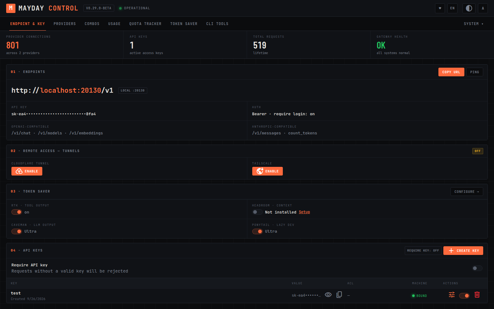
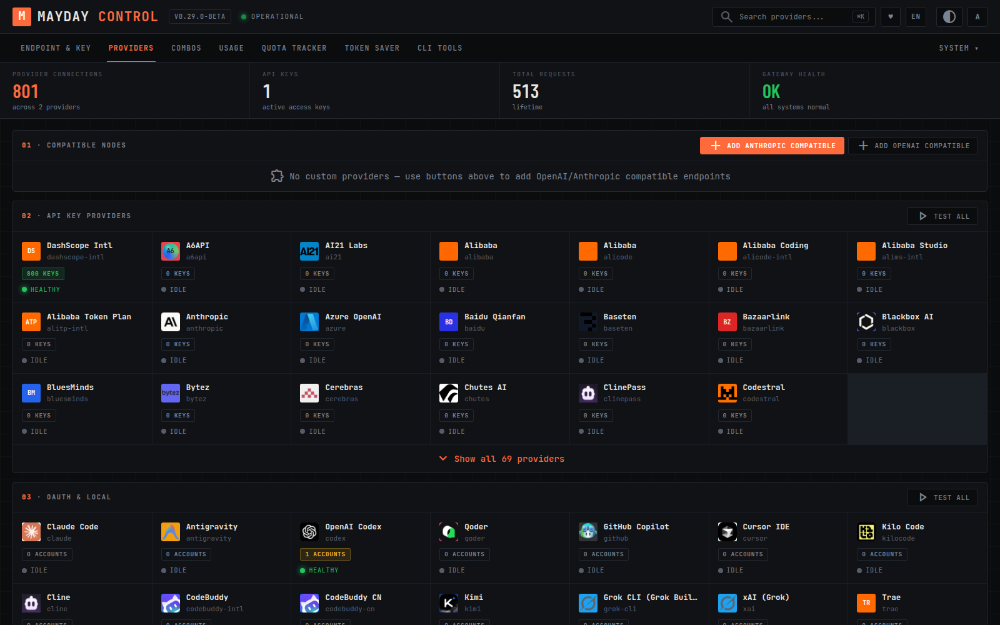
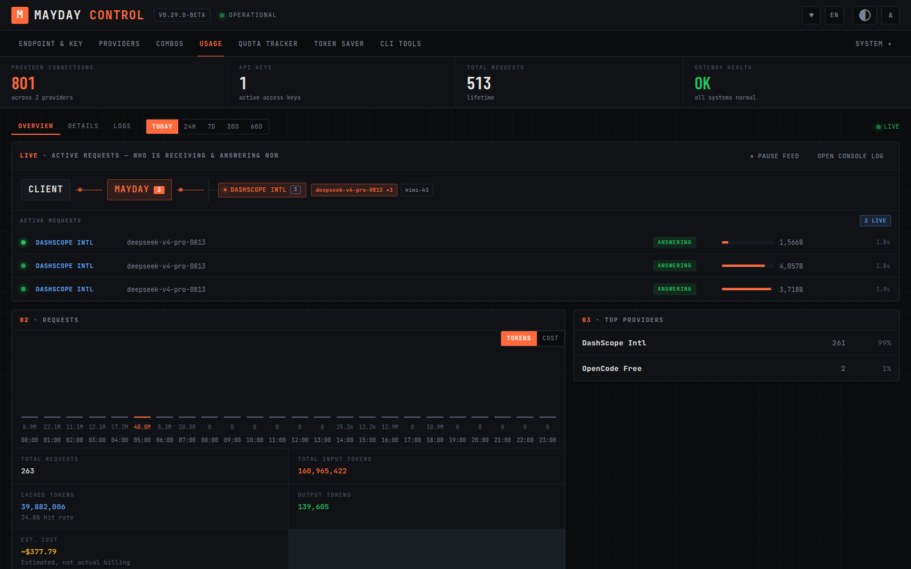
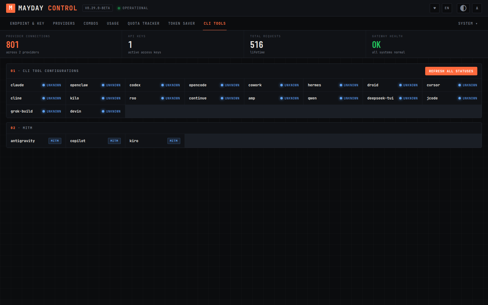
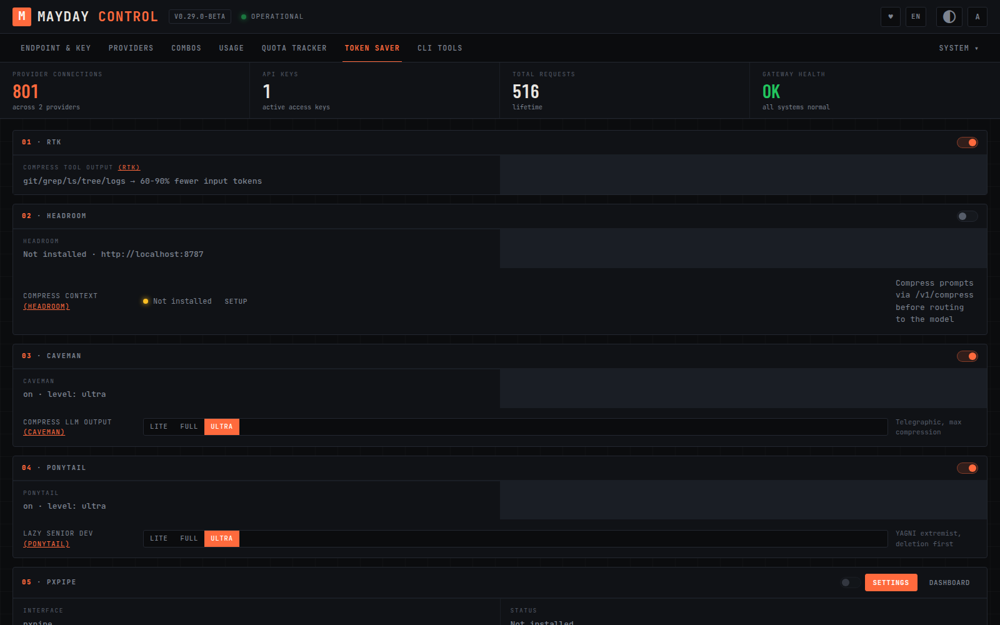
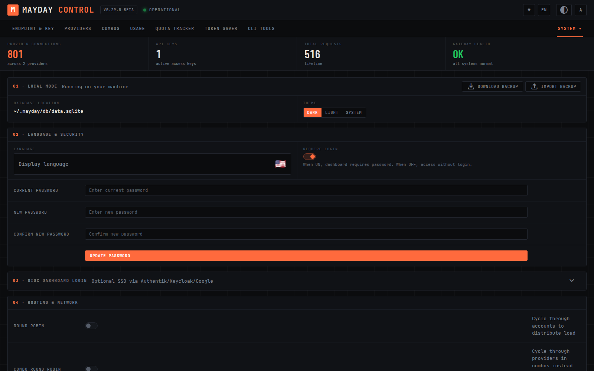

# Mayday Router

**Self-hosted AI gateway and model router** — one local endpoint that fronts
150+ LLM and media providers with failover combos, per-key access control,
real-time traffic visibility, and aggressive token-saving pipelines.

Mayday Router sits between your AI clients (IDEs, coding agents, chat UIs,
scripts) and the providers you have access to. It exposes a single
OpenAI-compatible **and** Anthropic-compatible API, routes each request to the
right account/model, retries and falls back across keys and providers, and
shows you exactly what is happening as it happens.

> Inspired by the open-source [9router](https://github.com/decolua/9router)
> project and its community forks. Mayday Router is an independent codebase
> with its own UI, features, and roadmap — see [Credits](#credits).

---

## Screenshots

| Endpoint & Key | Providers |
|---|---|
|  |  |

| Usage — live request flow | CLI Tools |
|---|---|
|  |  |

| Token Saver | Settings |
|---|---|
|  |  |

More: [combos](docs/screenshots/combos.png) ·
[skills](docs/screenshots/skills.png)

---

## Features

### Gateway core
- **One endpoint, two protocols** — OpenAI-compatible (`/v1/chat/completions`,
  `/v1/models`, `/v1/responses`, `/v1/embeddings`, …) and Anthropic-compatible
  (`/v1/messages`, `count_tokens`) on the same base URL.
- **Full media surface** — chat, embeddings, image generation, video, TTS,
  STT, web search, and web fetch through the same gateway.
- **150+ providers** out of the box (see [Supported providers](#supported-providers))
  plus arbitrary OpenAI/Anthropic-compatible endpoints.
- **Multiple accounts per provider** with priorities, per-account round-robin,
  sticky routing, one-by-one health testing, and bulk import.
- **OAuth onboarding** for coding-agent providers (Claude Code, OpenAI Codex,
  GitHub Copilot, Cursor, and more) — no manual token handling.
- **Free tiers** — several providers can be used without any key at all.

### Combos (model routing)
- **Fallback** — try models in order on failure (rate limit, 4xx/5xx, quota).
- **Round robin** — rotate models across requests to spread load.
- **Fusion** — query all models in parallel, then synthesize one answer.
- **Capacity adapters** — automatically route around models lacking vision,
  audio, PDF, or video capability when the request needs it.
- Presets for popular clients and per-combo strategy/sticky/timeout settings.

### Token Saver
- **RTK** — compress tool output (`git`/`grep`/`ls`/`tree`/logs) by 60–90%
  before it reaches the model.
- **Headroom** — external context-compression proxy integration.
- **Caveman** — telegraphic LLM-output compression (Lite / Full / Ultra).
- **Ponytail** — lazy-developer prompt compression (Lite / Full / Ultra).
- **PXPIPE** — optional local compression pipeline dashboard.
- **Guards** — Loop Guard, proxy-aware Circuit Breaker, and per-account
  Semaphore concurrency limiting.

### Observability
- **Live request flow** — a real-time panel (SSE-driven) that shows each
  request's actual lifecycle: received → routed (to a specific account) →
  answering (bytes streaming) → done, with provider-reported token counts,
  measured durations, and fallback hops. Nothing is simulated.
- **Usage analytics** — requests/tokens/cost charts, cached-token hit rate,
  per-model/per-provider/per-account/per-key breakdowns, request details.
- **Quota tracker** — per-provider used/limit bars with reset times.
- **Console log** — live-streaming gateway logs (app/PM2/Docker) with level
  filtering, search, and one-click copy.

### Operations
- **API keys with ACL** — per-key allow-lists for providers, combos, kinds,
  and models; machine binding; quick create/revoke.
- **Remote access** — Cloudflare Tunnel or Tailscale wizards to expose your
  instance securely.
- **Proxy pools** — outbound proxy pools with one-click relay deploys
  (Cloudflare Workers / Vercel / Deno) and a fitness tracker that quarantines
  failing proxies.
- **CLI Tools** — one-screen configuration of 15+ coding-agent CLIs
  (Claude Code, Codex, OpenCode, Kilo Code, Cline, Cursor, and more) to talk
  to your local gateway.
- **MITM helpers** — capture-based onboarding for providers that require it.
- **Local-first** — all state in a single SQLite directory; backup/restore
  from the UI; 33 UI languages; dark/light/system themes; responsive down to
  phone screens.

---

## Quick start (Docker)

```bash
docker build -t mayday-router .

docker run -d --name mayday-router \
  --restart always \
  -p 20128:20128 \
  -e JWT_SECRET="change-me-to-a-long-random-secret" \
  -e INITIAL_PASSWORD="choose-a-dashboard-password" \
  -e DATA_DIR=/app/data \
  -v mayday-data:/app/data \
  mayday-router
```

Open the dashboard at `http://localhost:20128`, sign in with your
`INITIAL_PASSWORD`, add a provider (or ten), create an API key, and point your
tools at `http://localhost:20128/v1`.

> The `DATA_DIR` volume holds everything — provider connections, API keys,
> usage history, and settings. Back it up before upgrades.

### From source

```bash
# Node.js 22+
npm install
npm run dev        # development on :20127

# or production
npm run build
npm start          # on :20128
```

---

## Configuration

All configuration is via environment variables (see `.env.example`):

| Variable | Required | Default | Purpose |
|---|---|---|---|
| `JWT_SECRET` | yes | — | Signs dashboard session cookies. Use a long random string. |
| `INITIAL_PASSWORD` | yes | — | Initial dashboard password (change it after first login). |
| `DATA_DIR` | yes | `/app/data` | Directory for the SQLite database and runtime state. |
| `PORT` | no | `20128` | HTTP listen port. |
| `REQUIRE_API_KEY` | no | `false` | Require an API key on the gateway endpoints. |
| `API_KEY_SECRET` | no | generated | Secret used for API-key derivation/encryption. |
| `MACHINE_ID_SALT` | no | generated | Salt for the stable machine identifier. |
| `OBSERVABILITY_ENABLED` | no | `true` | Record per-request usage details for the dashboard. |
| `ENABLE_REQUEST_LOGS` | no | `false` | Verbose request logging. |
| `AUTH_COOKIE_SECURE` | no | `false` | Set `true` when serving the dashboard over HTTPS. |
| `SEARXNG_URL` | no | — | Enables the built-in unauthenticated web-search provider. |
| `HTTP_PROXY` / `HTTPS_PROXY` / `ALL_PROXY` / `NO_PROXY` | no | — | Outbound proxy for upstream provider calls. |

---

## Using the gateway

Base URL: `http://<your-host>:20128/v1` — authenticate with
`Authorization: Bearer <api-key>` (create keys in **Endpoint & Key**).

```bash
curl http://localhost:20128/v1/chat/completions \
  -H "Authorization: Bearer $MAYDAY_KEY" \
  -H "Content-Type: application/json" \
  -d '{
    "model": "dashscope-intl/deepseek-v4-pro-0813",
    "messages": [{"role": "user", "content": "Hello"}],
    "stream": true
  }'
```

Model addressing: `<provider>/<model>` (e.g. `openai/gpt-5`,
`dashscope-intl/qwen3.8-max`, `kimi/kimi-k3`), a **combo name** for
fallback/round-robin/fusion routing, or an **alias** you define per model.

| Endpoint | Purpose |
|---|---|
| `POST /v1/chat/completions` | Chat (OpenAI-compatible, streaming + tools) |
| `POST /v1/messages` | Chat (Anthropic-compatible) |
| `GET /v1/models` | List available models |
| `POST /v1/responses` | OpenAI Responses API |
| `POST /v1/embeddings` | Embeddings |
| `POST /v1/images/generations` | Image generation |
| `POST /v1/audio/speech` · `POST /v1/audio/transcriptions` | TTS / STT |
| `POST /v1/videos` | Video generation |
| `POST /v1/search` · `/v1/web` | Web search / fetch |

---

## Dashboard guide

- **Endpoint & Key** — base URL, tunnels, token-saver summary, API keys.
- **Providers** — compatible nodes, API-key providers, OAuth & local; cards
  show live key counts and health from the circuit breaker.
- **Combos** — build fallback/round-robin/fusion groups; drag to reorder.
- **Usage** — live request flow, charts, top providers, request feed,
  details, and logs (real-time via SSE).
- **Quota Tracker** — provider quota/limit usage with reset windows.
- **Token Saver** — RTK / Headroom / Caveman / Ponytail / PXPIPE and guards.
- **CLI Tools** — guided configuration for each coding-agent CLI.
- **System** — media providers (embedding/image/video/TTS/STT/web), proxy
  pools, proxy fitness, skills, extended features, console log, translator
  debug, and settings.

---

## Extended features

Opt-in (default OFF) power features under **System → Extended**:

- **Skill Router (TF-IDF)** — classifies the user's intent and injects the
  matching skill's instructions into the request. Tune per-skill thresholds
  in the UI.
- **Session Skill Dedup** — injects a skill in full once per session, then
  sends only a short reminder on subsequent turns.
- **Manifest-driven Skills Registry** — create and manage skills as
  `skills/<id>/manifest.json` on disk; no shell execution involved.
- **Custom Skill Studio** — write and save your own skill manifests from the
  dashboard.
- **Hermes Memory Bridge** — read-only snapshot bridge to
  `DATA_DIR/hermes-bridge/` for sharing memory snapshots with a Hermes setup.

Skills are served self-hosted at `/skills/*` so any AI agent can fetch them.

---

## Supported providers

**API-key providers (105):** A6API · AI21 Labs · Alibaba · Alibaba Coding ·
Alibaba Studio · Alibaba Token Plan · Anthropic · AssemblyAI · AWS Polly ·
Azure OpenAI · Baidu Qianfan · Baseten · Bazaarlink · Blackbox AI ·
Black Forest Labs · BluesMinds · Brave Search · Bytez · Cartesia · Cerebras ·
Chutes AI · ClinePass · Codestral · Cohere · ComfyUI · Command Code ·
DashScope Intl · Databricks · Deepgram · DeepInfra · DeepSeek · ElevenLabs ·
Exa · Fal.ai · Featherless · Firecrawl · Fireworks AI · Fish Audio ·
FriendliAI · Galadriel · GigaChat (Sber) · GLM (China) · GLM Coding ·
Google PSE · Groq · Heroku AI · HuggingFace · Hyperbolic · Inworld TTS ·
Jina AI · Jina Reader · Kilo Gateway · Linkup · LlamaGate · Minimax (China) ·
Minimax Coding · Mistral · MMF · Morph · NanoBanana API · NanoGPT ·
Nebius AI · nScale · Ollama Local · Ollama Search · OpenAI · OpenCode Go ·
OVHcloud AI · Perplexity · Perplexity Agent · PlayHT · Predibase · PublicAI ·
Recraft · Runway ML · SambaNova · SD WebUI · SearchAPI ·
Self-hosted Embedding/STT/TTS · Serper · SiliconFlow · Snowflake Cortex ·
Stability AI · Tavily · Tencent Hunyuan · Together AI · TokenRouter · Topaz ·
Upstage · Venice AI · Vercel AI Gateway · Vertex Partner · Volcengine ·
Volcengine Ark · Voyage AI · Weights & Biases Inference · Xiaomi MiMo ·
Xiaomi MiMo (Token Plan) · Xquik · You.com Search · ZCode · ZenMux

**OAuth providers (19):** Antigravity · Claude Code · Cline · CodeBuddy ·
CodeBuddy CN · Cursor IDE · GitHub Copilot · GitLab Duo · Grok CLI ·
iFlow AI · Kilo Code · Kimi · Qoder · Qwen Code · Trae · Windsurf ·
xAI (Grok) · Zed · OpenAI Codex

**Free / free-tier (24):** Devin CLI · Freebuff · Gemini CLI · Kiro AI ·
MiMo Code Free · OpenCode Free · API.airforce · BytePlus ModelArk ·
Cloudflare · Coqui TTS · Edge TTS · Gemini · Google TTS · Kimchi · LLM7 ·
Local Device · NVIDIA NIM · Ollama Cloud · OpenRouter · Poolside · SearXNG ·
Tortoise TTS · Vertex AI

**Web-cookie providers (3):** Grok Web (Subscription) · Muse Spark Web
(Meta AI) · Perplexity Web (Pro/Max)

**Plus:** any OpenAI-compatible or Anthropic-compatible endpoint as a custom
node, and self-hosted media services.

---

## Security

- Dashboard sessions are signed with `JWT_SECRET`; enable `Require login` and
  set a strong password.
- Gateway endpoints can require API keys (`REQUIRE_API_KEY=true`) with
  per-key ACLs and machine binding.
- Local-only routes (tunnel control, CLI credential management) are gated by
  a machine-bound internal token, fail-closed.
- Credentials and state never leave `DATA_DIR` unless you expose a tunnel.

## Development

```bash
npm run dev     # dev server (Turbopack)
npm run build   # production build (webpack)
npm start       # serve production build
npm run lint    # eslint
```

UI mockups used for the design system live in `public/mockups/`
(`ui-redesign-v3.html` is the implemented Control Room design).

## Credits

Mayday Router is inspired by [9router](https://github.com/decolua/9router)
and its community forks (including VansRouter). Thanks to their maintainers
and contributors for paving the way. The Extended features adapt a safe
subset of `thunderkex/9router-extended`.

## License

See [LICENSE](LICENSE).
